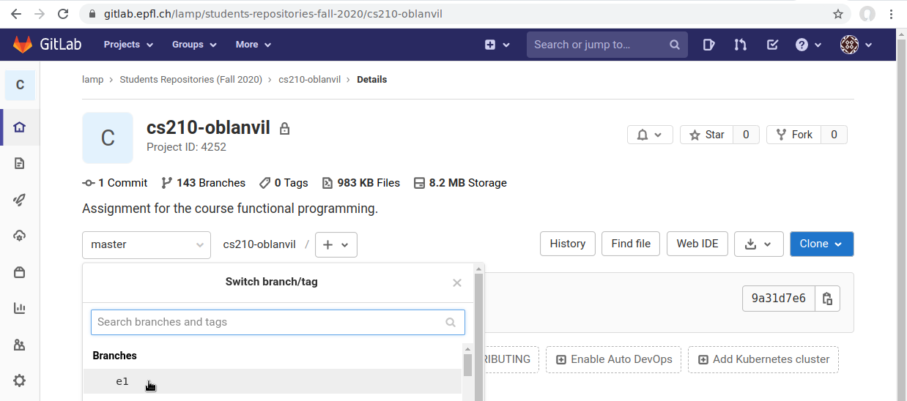
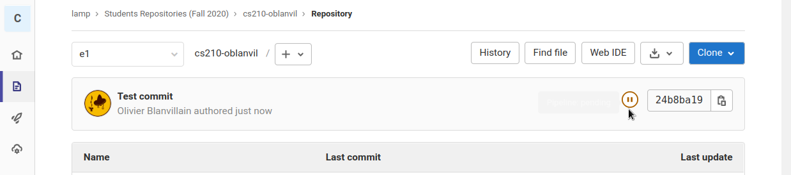
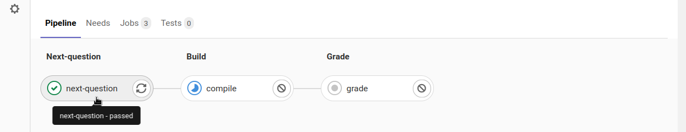
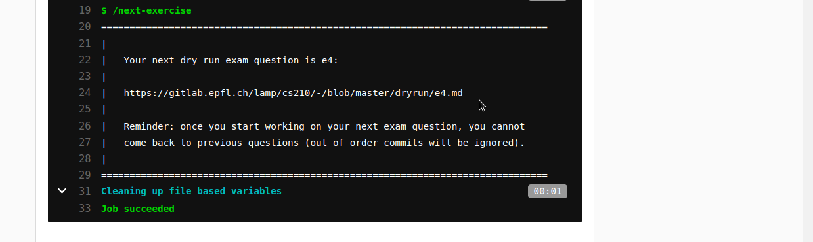

# Exam dry run

Wednesday, 16 December 2020, 13:15 - 15:00

This exam is open book in the sense that you are allowed to consult the PDF slides for all lectures in this course.

The exam consists of a list of programming assignments that you must solve in order, using the usual tools from the class (git, sbt, and your favorite text editor). Each student will be given a unique question order. Your personal exam is dynamically created, so that every time you solve a question, you are given the next one. You are not allowed to go back to your previous questions after you start working on the next one. We do not expect that you can necessarily solve all questions in this limited time, but you should do your best.

In addition to problem statements, each problem comes with a set of automated tests, just like for the labs. If your solution passes all the given tests, it is most likely correct and you can expect to obtain a full grade for that question. Also make sure to follow any additional requirements listed in the problem statement. Some of those requirements, such as avoiding the use of vars, are not covered by our automated tests and will be graded manually.

The TAs will be available on Discord during the exam in case you have questions or need help. You are only allowed to use our public discord channel for class and no other communication. It is your responsibility to ensure that you have access to reliable internet connection, hardware, and software for the duration of the exam. Also make sure that you are comfortable using the usual tools from the class, so that you can focus on the exam.

*No cheating*: Each student must solve the exam individually. Consulting with anyone except the teaching staff of this course during the exam or making your solution available to anyone is considered cheating and a reason for disciplinary action. We will use plagiarism detection tools on your solution. We reserve the right to follow up with some of you on zoom after the scheduled slot and ask you about solutions to your or similar questions, whether or not we suspect you cheated; this possibility is a normal part of the examination this year.

## How to obtain questions

Assignments are available on gitlab. Please clone the course repository at the start of the exam to have access to problem statements in case you lose your internet connection:

```
git clone https://gitlab.epfl.ch/lamp/cs210.git
```

Each assignment is published similarly to labs: the problem statements are given as markdown files in the following directory: https://gitlab.epfl.ch/lamp/cs210/-/tree/master/dryrun; the code skeleton for each problem is available in a separate branch of your private gitlab repository. Each student can find a link to their first exam question in the following .pdf file: https://gitlab.epfl.ch/lamp/cs210/-/blob/master/dryrun/first-questions.pdf. Links to subsequent questions are distributed after solving each question.

## How to submit questions

Your answers are submitted by pushing your code on gitlab, just like the labs. For detailed information, refer to labs submission instructions: https://gitlab.epfl.ch/lamp/cs210/-/blob/master/labs/grading-and-submission.md#committing-and-pushing-your-code. After you submit your solution, you will receive a preliminary grade for that question, as well as the link to your next question. This information will be available in the GitLab CI, the following screenshot show how to obtain the link to your next question:

Starting from your GitLab project page, click on the branch corresponding to your current question:



Then click on the circular icon next to your commit hash:



The CI pipeline has three stages; the first one gives you the link to your next question; the second one compiles your code; the third one gives you a grade using the provided automated tests:



Your next question is provided as follows:



You are allowed to push multiple times for the same question (only the last commit will be considered). However, you are not allowed to go back to your previous questions after you start working on the next one. More precisely, we will ignore commits that do not respect your question order.

## How to run tests

Refer to labs submission instructions for detailed information on how to run the tests: https://gitlab.epfl.ch/lamp/cs210/-/blob/master/labs/grading-and-submission.md#local-tests-and-grading

## Recommended workflow summary

After you have obtained a question, do the following:

1. read the requirements carefully
2. write the solution taking the requirements into account
3. make sure your solution compiles
4. make sure your solution passes the local tests on your machine; if it does not, repeat previous steps
5. submit your solution using git; if it does not pass the tests, repeat the previous steps
6. if your solution is accepted as correct by CI, request the next question

If you feel you are spending more time on the question and will likely not solve it, then go to step 6 even if your solution is not accepted to get a chance at solving subsequent question. Note that you will be losing 2 points when you do not solve a question, so take this into account.

## How do we grade the exam

Each question you solve correctly gives you 10 points. A question is solved correctly if it passes all the tests including those we made available to you (a maximum grade of 10/10), and the solution fulfills all the requirements listed in the problem statement (such as not using vars). If you do not manage to solve a particular question, you can move on to the next one by submitting your partial solution or even an empty commit. Those incorrect solutions are penalized with -2 points. Given the exam format, those points will then be converted to traditional grades depending on the overall exam performance. Our aim is that a student who mastered the material can solve approximately 5 questions in this time period and obtain a maximum grade, taking into account small variations in question difficulty. This estimate is provided only to help your time planning.
