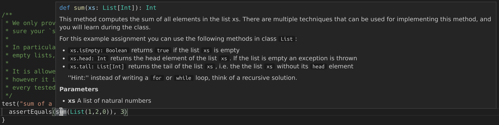

# Example lab

The goal of this lab is to familiarize yourself with the infrastructure and tools used in this class. Even though the grade in this lab won't influence your grade for the course, it is important that you work through this lab carefully.

## Part 1: Obtaining the Project Files

First, make sure you've followed the [Tools Setup](tools-setup.md) page.

**At this point, we strongly encourage you to take the time to read at least the first three chapters of the [Git Book](https://git-scm.com/book/en/v2). If you just copy-paste the commands we give you without understanding them, it's likely that you'll make a mistake somewhere and waste time. Git can be a huge productivity enhancer when used correctly, so it's definitely worth the investment!**

We'll starting by cloning the repository containing all our lab (make
sure to replace `GASPAR` with your EPFL username (the one with letters, not the
one with number) in the following command).

```shell
git clone -b example git@gitlab.epfl.ch:lamp/student-repositories-f20/cs210-GASPAR.git cs210-example
```

```shell
cd cs210-example
```

Now that we've obtained the project, let's take a look at its structure:

```shell
.
├── build.sbt
├── project
│   ├── ...
└── src
    ├── main
    │   └── scala
    │       └── example
    │           └── Lists.scala
    └── test
        └── scala
            └── example
                └── ListsSuite.scala
```

- All the files ending with `.sbt` or in the `project/` directory are build tool configuration files: you don't need to modify them or look at them for any of the labs
- The project sources are in `src/main/scala/`
- The sources of the unit tests are in `src/test/scala/`. You will need to make all the tests pass to complete the labs, and you should write additional tests to check for cases that our tests do not cover.

## Part 2: Using sbt

Start sbt by running:
```shell
sbt
```

Once it's finished starting (this may take a while), you'll be able to enter sbt
commands. You can compile your project using `compile` and run the tests with
`test` (this automatically compiles your code if needed to). Note that if
compilation fails, no tests will be run. The first time you'll run `test` in an
lab you should see many errors: that's normal, your job is to make the
tests pass! To do this, it's useful to understand in details what the test
output means, here's an example:


This tells us several things:

- There's a test named `max of a few numbers (10pts)` in the class `ListsSuite` in the package `example`
- The test failed with an exception: `scala.NotImplementedError: an implementation is missing`. This is followed by a stack trace showing where the exception happened.
- This exception was thrown from the method `scala.Predef$.???` in the file `Predef.scala` at line 284.
- This method was called from `example.Lists$.max` in the file `Lists.scala` at line 40.
- ... which was itself called from the method `example.ListsSuite.max of a few
  numbers` in the file `ListsSuite.scala` at line 83.

It's now time to look at some code: the next section will show you how to start and navigate using the IDE.

## Part 3: Using the IDE

### Startup

This course is run with an experimental version of Scala called Dotty that will become Scala 3 in the future. Because it's so new, most IDEs like IntelliJ and Eclipse are unlikely to work correctly with it. Thankfully we've developed our own IDE support. It's designed to work with any text editor but we currently only support VSCode. If you've followed the [Tools Setup](https://lampepfl-courses.github.io/moocs/tools-setup/Tools%20Setup.html) page you should have VSCode installed by now, but don't start it just yet, instead run the following command from `sbt`:
```shell
launchIDE
```

This will download the Dotty extension for VSCode and set everything up. You will need to do this for every lab, and we recommend always using this command to start the IDE.

The first time the IDE starts, it will take some time to download more components, as displayed in the bottom left:


#### Data collection

Fixing bugs in the compiler and the IDE is much easier when we have all the information needed to reproduce them. To help us achieve that, we've added an optional data collection mechanism in the IDE extension, when you start an lab, you'll see the following pop-up:


You are free to either allow or deny the data collection, but we would appreciate it if you clicked "Allow". If you do, you'll contribute to making Scala better! If you change your mind, you can turn on or off the data collection at any time by clicking on the "Scala telemetry" button on the bottom-left of the IDE window:


### Usage

It's now time to dig in! Earlier we talked about a failing test, the stack trace told us that it was failing on line 83 of the file ListsSuite.scala, so let's open that file:


Here's the source code of the test method:


This looks like a regular method except for a few things:

- It starts with `@Test`, this is an annotation that lets JUnit (the testing framework we use) know that this is a test method.
- The name of the method starts and ends with backticks (\`): this is what allows us to put spaces in the method name. Normally, names defined in Scala cannot contain special characters such as spaces or dashes, but any character is allowed as long as backticks are put around the name (even emojis 🔥!). We've taken advantage of this in the tests we define to give them nicer names: `max of a few numbers failed` is easier to read than `maxOfAFewNumbers failed`, but this is just a convention: if you define your own tests you're free to name them however you want.

Recall that the second line of the stack trace was:
```scala
at example.Lists$.max(Lists.scala:40)
```

This tells us that the crash happened when calling `max`, we can hover with our mouse over the call to `max` in the test method to get more information on it:




The hover is split into two parts: the first part is:
```scala
(xs: List[Int]): Int
```
This means that `max` is a method that takes a `List` of `Int` as argument and
returns an `Int`. The second part is the documentation of `max`. We can jump to
the definition of max by `Ctrl+click` (`Cmd+click` on Mac) or by `right click ->
Go to Definition` (*note: this is currently broken under Windows, you'll have to
manually open `src/main/scala/example/Lists.scala`*). Once there we see:


Now we know why the test failed: `max` calls `???`, which is a method defined in the Scala standard library that simply crashes your program: whenever you see it in an lab it means that this is something you need to replace by your own implementation.

You now know enough to be able to work with the IDE, here are some additional tips:

- When you press `Enter` to make a new line, the IDE will automatically indent the
  line if needed (for example, if the last word on the previous line was
  `then`), however it will never unindent code for you (for example, when
  writing `else`). You can always indent code manually by pressing `Tab` and
  unindent it by pressing `Shift + Tab`.
- When working on an lab,  you are free to create as many methods, classes and objects as you want. **But you shouldn't change the name of existing methods, classes and objects, because that may break the automated grading system, this is important!**.
- You can see a list of all warnings and errors reported by the compiler by clicking on  at the bottom left of VSCode.
- The IDE can show you on hover the documentation of classes, defs and vals defined in the current project but support for external project is currently missing. To compensate for this, you can consult the documentation online:
  - The documentation for the Scala standard library is at [https://www.scala-lang.org/files/archive/api/2.13.1/](https://www.scala-lang.org/files/archive/api/2.13.1/)
  - The documentation for the Java standard library is at [https://docs.oracle.com/en/java/javase/11/docs/api/index.html](https://docs.oracle.com/en/java/javase/11/docs/api/index.html)
- You can customize Visual Studio Code as much as you want, including installing additional extensions, but please avoid installing other Scala-related extensions: they may conflict with the one we use for this course.
- While working on your lab, you will regularly want to go back to the sbt console to run the tests. You could simply run the command `test` every time, but you can take advantage of the watch mode instead: if a command is prefixed by `~`, sbt will watch the source directory for changes and re-run the command every time a file is saved. So a possible workflow is:

    1. Start sbt
    2. Run `launchIDE`
    3. Once the IDE has started, go back to sbt and run `~test` (or run `~compile` if you don't want to look at the tests)
    4. Work in the IDE, and check the output of the sbt console from time to time

- We're actively working on improving the IDE support using Visual Studio Code
  and interested in hearing your ideas and suggestions. Feel free to share your
  feedback (both good and bad) with us using Gitlab issues!

## Part 4: Running your code

Writing code and running tests is nice, but sometimes more direct feedback is useful, like when you want to experiment with Scala, or try out some methods that you implemented. You can do this using the Scala REPL (Read/Eval/Print Loop) or with a worksheet.

### The REPL
After having started sbt, you can start the REPL by typing `console`, you will see the following prompt:
```scala
scala>
```
At this point you can write any Scala expression you want, for example:
```scala
scala> val l = List(3,7,2)
val l: List[Int] = List(3, 7, 2)
```

(If you write an expression without wrapping it in a `val` or a `def`, the REPL will give it a name for you, starting with `res`)

```scala
scala> l.isEmpty
val res0: Boolean = false

scala> println(res0)
false

scala> l.tail.head
res1: Int = 7

scala> List().isEmpty
res2: Boolean = true
```

The classes of the lab are available inside the REPL, so you can for instance import all the methods from `object Lists` and start using `max`:

```scala
scala> import example.Lists._
import example.Lists._

scala> max(List(1,3,2))
res1: Int = 3
```

You can enter a multiline expression in the REPL by using `Alt+Enter`
(`Option+Enter` on macOS) instead of `Enter`:

```scala
scala> if 1 == 1 then
     |   "a"
     | else
     |   "b"
val res0: String = a
```

In order to exit the Scala REPL and go back to sbt, type `Ctrl+D`.

### The worksheet mode
A *worksheet* is a file where every line of code written in the IDE is executed and its output displayed as a comment.

#### Creating a worksheet
Any file that ends in `.sc` is considered to be a worksheet by the IDE. Once VSCode is launched in a project, all you have to do is create a new file and save it (`Ctrl+N, Ctrl+S`) using any name as long as it ends in `.sc`.

#### Using the worksheet mode

Inside this file, you can type any line of code you would type in the REPL. To run the worksheet, either press the "Run this worksheet" button at the top of the file, or save the file. Each line of code will be executed one by one and its output is shown in green on the right. If your code contains an infinite loop, the worksheet will never finish running by itself, but you can cancel it by clicking the same button used to run the worksheet at the top of the file.

**IMPORTANT**: When you run a worksheet, you should have sbt open and either `~test` or `~compile` running as recommended in Part 3, otherwise changes to other files won't be reflected in the output of your worksheet.

## Part 5: Submitting your Solution

[Click here to learn how to submit your lab.](grading-and-submission.md)
